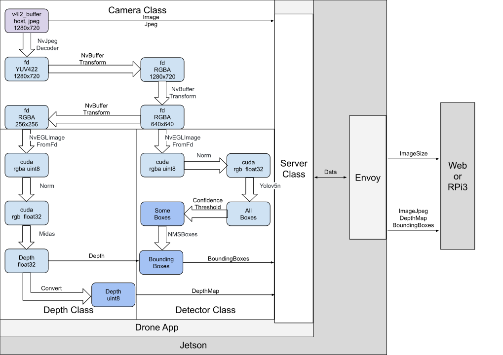

# Drone App
This drone app is a C++ program on [Jetson Nano](https://developer.nvidia.com/embedded/jetson-nano-developer-kit). It is used to capture images, detect flowers, estimate depth, and serve results to the UI and RPi3.

Up to now, it can 
- load the config
- capture camera images
- detect flowers in an image
- caculate depth map of an image
- serve data to the UI with auth or RPi3 without auth

## Build
### Dependencies

- [gRPC](https://github.com/grpc/grpc)
- CUDA
- [VPI](https://docs.nvidia.com/vpi/1.2/index.html)
- [spdlog](https://github.com/gabime/spdlog)
- OpenSSL
- OpenCV
- [yaml-cpp](https://github.com/jbeder/yaml-cpp)
- [jetson-utils](https://github.com/dusty-nv/jetson-utils)
- [jetson-inference](https://github.com/dusty-nv/jetson-inference)
- [jetson_multimedia_api](https://docs.nvidia.com/jetson/l4t-multimedia/index.html)

Run this [script](tools/libraries.sh) to build and install those libraries.

To install jetson-inference and jetson-utils: [jetson-inference](
https://github.com/dusty-nv/jetson-inference/blob/master/docs/building-repo-2.md)

### Cmake
Run this [script](tools/cmake.sh) to install the newer version of Cmake.

### Model
This program uses two models: [yolov5](https://github.com/ultralytics/yolov5) for flowers detection and [MiDaS](https://github.com/isl-org/MiDaS) for depth estimation. And this program also uses [TensorRT](https://developer.nvidia.com/tensorrt) to speed up network process.
#### Yolov5
1. Install necessary packages, PyTorch and Torchvision: [NVIDIA Jetson Nano Deployment](https://github.com/ultralytics/yolov5/issues/9627)
2. Install onnx
```shell
pip3 install onnx
```
3. Fix a [bug]((https://stackoverflow.com/a/74089097)) for protobuf: copy this [file](https://raw.githubusercontent.com/protocolbuffers/protobuf/main/python/google/protobuf/internal/builder.py) to ~/.local/lib/python3.6/site-packages/google/protobuf/internal/builder.py
4. Convert the Yolov5n PyTorch model to ONNX
```shell
python3 export.py --weights yolov5n_flower.pt --include onnx
```
5. Convert the ONNX to TensorRT with fp16 
```shell
/usr/src/tensorrt/bin/trtexec --onnx=/home/jetson/yolov5/yolov5n_flower.onnx --saveEngine=yolov5n_flower.engine --fp16 --workspace=4096
```
#### MiDaS
1. Download the [MiDaS v2.1 small ONNX model](https://github.com/isl-org/MiDaS/releases/download/v2_1/model-small.onnx)
2. Convert the ONNX to TensorRT with fp16 
```shell
/usr/src/tensorrt/bin/trtexec --onnx=/home/jetson/model-small.onnx --saveEngine=midas_v21_small.engine --fp16 --workspace=4096
```
## Run
[Config](tools/config.yaml) is required to run the app. You may also need to create [certificates](/tools/cert/) and [model](/model/).

## Server

This program uses gRPC as the interface to transfer data.

Due to browser limitations, [gRPC-web](https://github.com/grpc/grpc-web) needs a special proxy to connect to gRPC services; by default, gRPC-web uses [Envoy](https://www.envoyproxy.io/). Run this [script](tools/envoy.sh) to extract and install Envoy. To run Envoy with the [config](tools/envoy.yaml):

```shell
envoy -c envoy.yaml
```

## Setup Jetson
Booting Jetson Nano from a flash device makes everything smooth: https://github.com/jetsonhacksnano/bootFromUSB

## How to interact with Drone App in Rpi
[example](../rpi3/README.md)

## Dataflow
